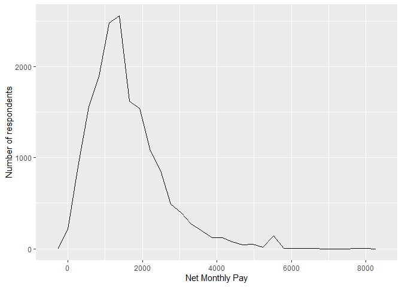
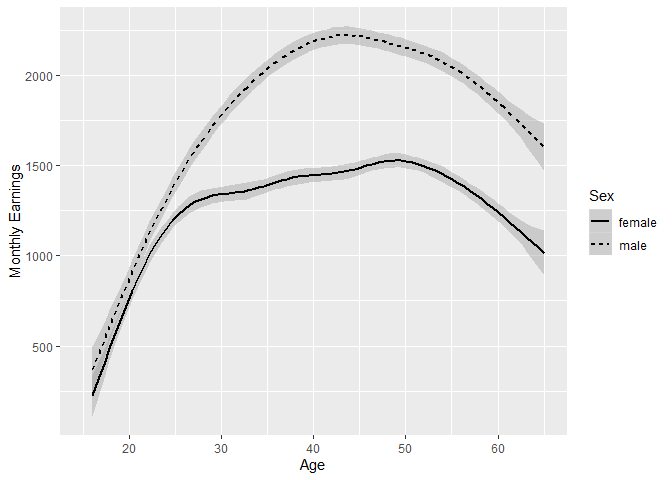
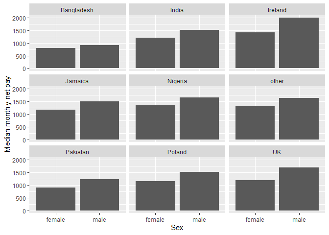

Statistical assignment 4
================
Simone Long\_135288
29/02/2020

``` r
setwd("C:/Users/simon/OneDrive/Documents/datan3_2019")

library(tidyverse)
Data8 <- read_tsv("data/UKDA-6614-tab/tab/ukhls_w8/h_indresp.tab")
Data8 <- Data8 %>%
        select(pidp, h_age_dv, h_payn_dv, h_gor_dv)
setwd("C:/Users/simon/OneDrive/Documents/datan3_2019")
Stable <- read_tsv("data/UKDA-6614-tab/tab/ukhls_wx/xwavedat.tab")
Stable <- Stable %>%
        select(pidp, sex_dv, ukborn, plbornc)
Data <- Data8 %>% left_join(Stable, "pidp")
rm(Data8, Stable)
Data <- Data %>%
        mutate(sex_dv = ifelse(sex_dv == 1, "male",
                           ifelse(sex_dv == 2, "female", NA))) %>%
        mutate(h_payn_dv = ifelse(h_payn_dv < 0, NA, h_payn_dv)) %>%
        mutate(h_gor_dv = recode(h_gor_dv,
                         `-9` = NA_character_,
                         `1` = "North East",
                         `2` = "North West",
                         `3` = "Yorkshire",
                         `4` = "East Midlands",
                         `5` = "West Midlands",
                         `6` = "East of England",
                         `7` = "London",
                         `8` = "South East",
                         `9` = "South West",
                         `10` = "Wales",
                         `11` = "Scotland",
                         `12` = "Northern Ireland")) %>%
        mutate(placeBorn = case_when(
                ukborn  == -9 ~ NA_character_,
                ukborn < 5 ~ "UK",
                plbornc == 5 ~ "Ireland",
                plbornc == 18 ~ "India",
                plbornc == 19 ~ "Pakistan",
                plbornc == 20 ~ "Bangladesh",
                plbornc == 10 ~ "Poland",
                plbornc == 27 ~ "Jamaica",
                plbornc == 24 ~ "Nigeria",
                TRUE ~ "other")
        )
```

1.  Univariate distribution (20 points).
    
    ``` r
    library(ggplot2)
    Data %>%    
    ggplot(aes(h_payn_dv)) + 
    geom_freqpoly() +
    xlab("Net Monthly Pay") +
    ylab("Number of respondents")
    ```
    
    <!-- -->

The median monthly pay of UK residents (among those who responded)
appears to fall around £1500. Using this sample to generalise, we can
assume that the majority of UK residents fall in a middle/working class
income bracket.

2.  Line chart (20 points).
    
    ``` r
    Data %>%
    ggplot(aes(x = h_age_dv, y = h_payn_dv, group=sex_dv)) +
    geom_smooth(aes(linetype=sex_dv), color="black") +
    xlim(15, 65) +
    xlab("Age")+
    ylab("Monthly Earnings") +
    labs(linetype="Sex")
    ```
    
    <!-- -->

Among this sample’s respondents, it seems that men tend to earn more
than women. This disparity is particularly present between those aged 30
and 50 (with a dramatic difference in monthly earnings), as competition
for high-earning jobs tends to be fiercest among those in this age
bracket.

3.  Faceted bar chart (20 points).
    
    ``` r
    #DONE
    Data <- Data %>%
    group_by(sex_dv) %>%   
    mutate(medpay = median(h_payn_dv, na.rm = TRUE))
    
    Data %>%
    drop_na(placeBorn, sex_dv) %>%
    ggplot(aes(x = sex_dv, y = medpay)) +
        geom_bar(stat = 'identity') +
        facet_wrap( ~ placeBorn) +
        ylim(0, 2000) +
        xlab("Sex") +
        ylab("Median monthly net pay")
    ```
    
    <!-- -->

There is no significant difference in the gender pay gap across
different countries of origin. Men have a consistently higher median net
monthly pay than women, highlighting the global epidemic of sexism in
the working world.

4.  Heat map (20 points).
    
    ``` r
    #ARGH    
     Data2 <- Data %>% 
    group_by(h_gor_dv, placeBorn) %>%
    mutate(meanage = mean(h_age_dv))
    
    Data2 %>%
    drop_na(h_gor_dv, placeBorn) %>%
    ggplot(aes(x = h_gor_dv, y = placeBorn, fill = meanage)) +
    geom_tile(stat = 'identity') +
    theme(axis.text.x = element_text(angle = 90)) +
    xlab("Region") +
    ylab("Country of Birth") +
    labs(fill="Mean Age")
    ```
    
    <!-- -->

The average age of the population tends not to be significantly young or
old relative to country of origin and region settled in in the UK. But
it should be noted that the average age of those from Nigeria has a
younger trend (i.e. below the age of 40), especially among those who
have settled in Scotland, South West England and Yorkshire, with the
oldest average coming from Jamaica and settling in Scotland.

5.  Population pyramid (20 points).
    
    ``` r
    Data %>%
    ggplot(mapping = aes(x = h_age_dv, fill = sex_dv)) +
        geom_bar(data=subset(Data, sex_dv == "female"))+
        geom_bar(data=subset(Data, sex_dv == "male"), aes(y=..count..*(-1)))+
         coord_flip() +
        labs(fill="Sex") +
        xlab("Age") +
        ylab("n")
    ```
    
    <!-- -->

The age of the sample is fairly evenly distributed among men and women.
There is, however, a marginally greater number of women sampled,
especially those age 30-50.
